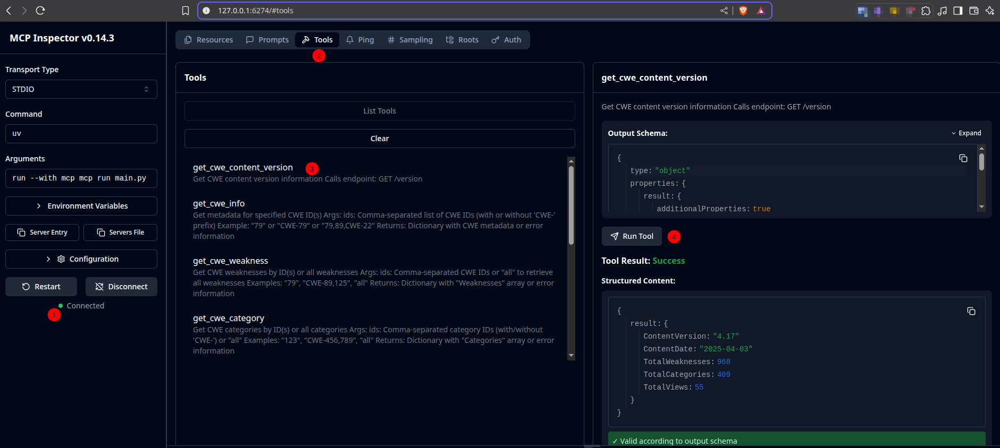

# CWE Search MCP

**A Python-based interface to MITRE's Common Weakness Enumeration (CWE) database via the official API, enabling seamless vulnerability research and integration with MCP-compatible systems.**

[](https://python.org)
[](https://opensource.org/licenses/MIT)
[](https://cwe.mitre.org/data/downloads.html)
[](https://pypi.org/project/fastmcp/)
[](https://github.com/astral-sh/uv)

[](https://x.com/BilelEljaamii)
[](https://www.linkedin.com/in/bileleljaamii/)
[](https://github.com/Bilel-Eljaamii)


## Overview

The CWE Search MCP provides a robust Python implementation for interacting with MITRE's Common Weakness Enumeration (CWE) database through its official API. Designed for security researchers, developers, and vulnerability analysts, this mcp enables efficient querying of vulnerability information and integrates seamlessly with MCP-compatible systems using stdio transport.

This solution solves the problem of fragmented vulnerability research by providing a unified interface to:

- Retrieve detailed CWE information programmatically
- Explore vulnerability relationships and hierarchies
- Integrate CWE data into security tooling and workflows
- Automate vulnerability analysis and reporting

## Key Features

- **Comprehensive Vulnerability Lookup**: Retrieve detailed information by CWE ID
- **Intelligent Search**: Find vulnerabilities by keyword across descriptions
- **Taxonomy Navigation**: Explore CWE categories and views
- **Relationship Mapping**:
  - Parent/child vulnerability relationships
  - Full ancestor/descendant hierarchies
  - View-filtered relationship analysis
- **Automatic Normalization**: Handles CWE IDs with or without "CWE-" prefix
- **Zero Configuration**: No authentication required for MITRE's public API
- **MCP Integration**: Ready for stdio transport with MCP-compatible systems
- **Batch Processing**: Retrieve multiple vulnerabilities in single requests

## Implemented API Endpoints

The mcp implements the following MITRE CWE API endpoints:

| Endpoint | Description |
|----------|-------------|
| `/cwe/version` | Get CWE content version information |
| `/cwe/{id}` | Retrieve metadata for specified CWE ID(s) |
| `/weakness/{id(s)}` | Get weaknesses by ID(s) or all weaknesses |
| `/cwe/category/{id(s)}` | Retrieve categories by ID(s) or all categories |
| `/cwe/view/{id(s)}` | Get views by ID(s) or all views |
| `/cwe/{id}/parents` | Get parents of a weakness (view-filtered) |
| `/cwe/{id}/children` | Get children of a weakness (view-filtered) |
| `/cwe/{id}/ancestors` | Get ancestors of a weakness (view-filtered) |
| `/cwe/{id}/descendants` | Get descendants of a weakness (view-filtered) |

## Getting Started

### Prerequisites

- Python 3.10+
- uv package manager

### Installation

1. Clone the repository:

   ```bash
   git clone https://github.com/Bilel-Eljaamii/cwe-search_mcp.git
   cd cwe-search_mcp
   ```

2. Install dependencies:

   ```bash
   pip install requests fast-mcp
   ```

## Usage Guide

### Standalone Execution

Run the mcp as a standalone module:

```bash
DANGEROUSLY_OMIT_AUTH=true mcp dev main.py
```
Output:
``` js
[06/28/25 12:46:09] INFO     Starting cwe-search_mcp
Starting MCP inspector...
⚙ Proxy server listening on 127.0.0.1:6277
⚠  WARNING: Authentication is disabled. This is not recommended.
New STDIO connection request
STDIO transport: command=/usr/bin/uv, args=run,--with,mcp,mcp,run,main.py
Created server transport
Created client transport
🔍 MCP Inspec
```



### MCP Client Integration
To integrate the CWE Search Service with your MCP client:

1. Locate Configuration: Open your MCP client configuration file

2. Update Path: Set CWE_SEARCH_SERVICE_PATH to the absolute path of your local installation directory

3. Add to your mcp client configuration file, modify the 3.`"CWE_SEARCH_SERVICE_PATH"` as you self dir.

```json
"cwe-search_mcp": {
  "autoApprove": [],
  "disabled": false,
  "timeout": 60,
  "type": "stdio",
  "command": "uv",
  "args": [
    "--directory",
    "CWE_SEARCH_SERVICE_PATH",
    "run",
    "main.py"
  ]
}
```

Example API calls using Python:

```python
from cwe_search import get_cwe_info, search_cwe_by_keyword

# Get CWE-79 details
cwe_79 = get_cwe_info("79")

# Get multiple CWEs
multiple_cwes = get_cwe_info("79,89,CWE-125")

# Search for SQL-related vulnerabilities
sql_vulns = search_cwe_by_keyword("SQL injection", max_results=10)

# Get vulnerability ancestors
ancestors = get_cwe_ancestors("89", view="1000")
```

### MCP Integration

The mcp uses stdio transport for seamless integration with MCP-compatible systems:

1. **Start the mcp**:

   ```bash
   python main.py
   ```

2. **Send MCP-formatted requests** via stdin

Example MCP request:

```json
{
  "function": "get_cwe_info",
  "params": {"ids": "79,89"},
  "id": "request-123"
}
```

Example MCP response:

```json
{
  "result": {
    "79": { /* CWE-79 data */ },
    "89": { /* CWE-89 data */ }
  },
  "id": "request-123"
}
```

### Key Notes

- **Authentication**: No credentials required - MITRE's CWE API is publicly accessible
- **Input Normalization**: MCP automatically handles CWE ID formats:
  - `79` → Normalized to `79`
  - `CWE-79` → Normalized to `79`
  - `cwe79` → Normalized to `79`
- **Batch Processing**: Comma-separated IDs supported for most endpoints
- **`all` Keyword**: Retrieve all items for weakness, category, and view endpoints

## Dependencies

- [requests](https://pypi.org/project/requests/) - HTTP library for API communication
- [fastmcp](https://pypi.org/project/fastmcp/) - The fast, Pythonic way to build MCP servers and clients.

```bash
# Using uv (recommended)
uv init
uv venv
source ./venv/bin/activate
uv pip install "mcp[cli]" "requests"
```

## Contributing

We welcome contributions! Please follow these steps:

1. Fork the repository
2. Create your feature branch (`git checkout -b feature/your-feature`)
3. Commit your changes (`git commit -am 'Add some feature'`)
4. Push to the branch (`git push origin feature/your-feature`)
5. Open a pull request

Please ensure your code follows PEP 8 style guidelines and includes appropriate tests.

## License

This project is licensed under the MIT License - see the [LICENSE](LICENSE) file for details.

## Acknowledgements & Resources

- **MITRE Corporation** for maintaining the Common Weakness Enumeration database
- [Official CWE Website](https://cwe.mitre.org/)
- [CWE API Documentation](https://cwe.mitre.org/data/downloads.html)
- [CWE List Version 4.14](https://cwe.mitre.org/data/xml/cwec_latest.xml.zip)

---

**Empower your vulnerability research** with direct access to MITRE's CWE database through this lightweight, integration-ready MCP. Contribute, customize, and enhance your security workflows today!
